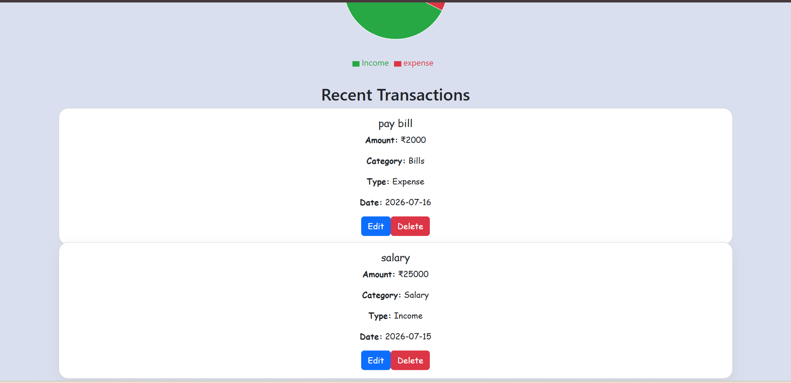
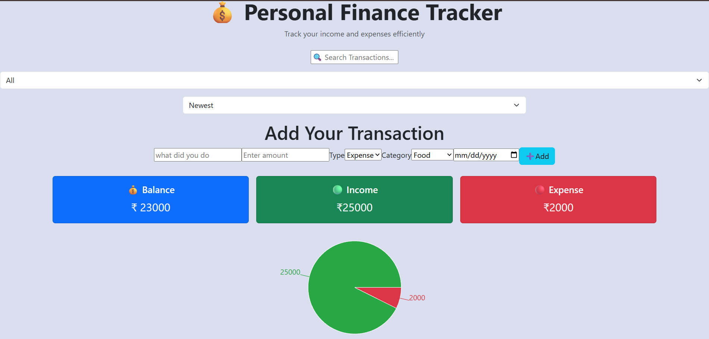

# 💰 Personal Finance Tracker

A responsive Personal Finance Tracker built with React that helps users manage their income and expenses. It supports adding, editing, deleting, searching, filtering, sorting, and visualizing transactions using interactive charts.

---

## 🚀 Features

- ➕ Add new transactions
- ✏️ Edit existing transactions
- 🗑️ Delete transactions
- 🔍 Search transactions by title
- 🎯 Filter by Income or Expense
- ↕️ Sort by Newest, Oldest, Highest Amount, and Lowest Amount
- 💾 Save data using Local Storage
- 📊 Interactive Pie Chart (Recharts)
- 💳 Dashboard with Balance, Income, and Expense summary
- 📱 Responsive UI using Bootstrap

- 
## 📸 Screenshots

## 🛠️ Technologies Used

- React.js
- JavaScript (ES6+)
- Bootstrap 5
- Recharts
- CSS Modules
- HTML5
- Local Storage API

- 
## 👩‍💻 Author Sonal Sharma
https://github.com/sonalsharma03
